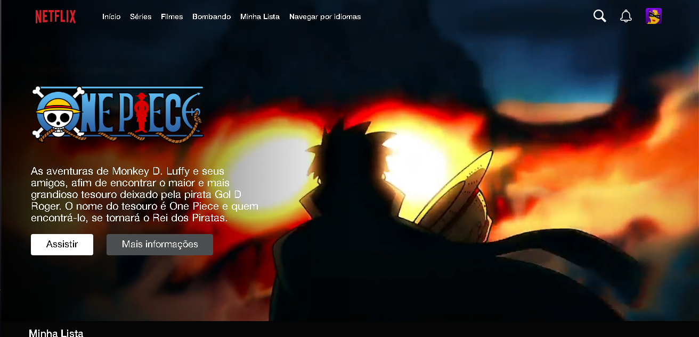
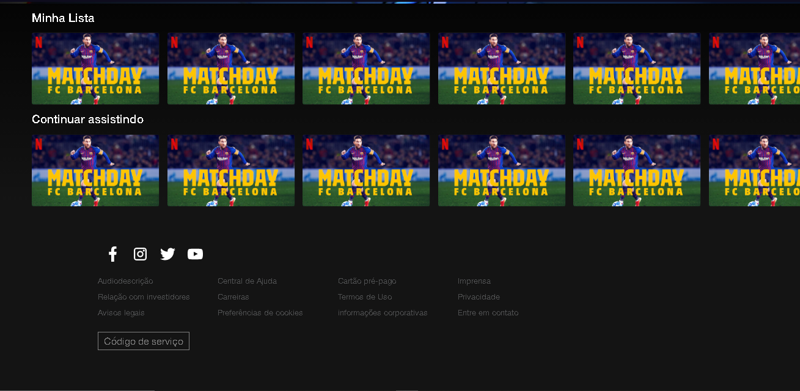
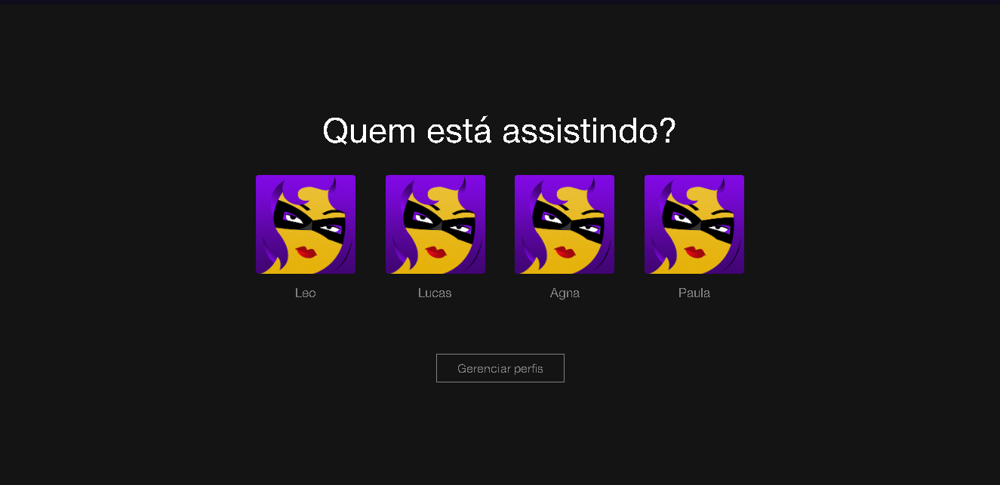

# Netflix

## 🖥 Projeto

Esse é um projeto Web Responsivo que eu fiz para treinar mais sobre as linguagens utilizadas, consta em um clone de netflix.

## 🚀 Tecnologias

Esse projeto foi desenvolvido com as seguintes tecnologias:

- HTML
- CSS
- JAVASCRIPT

